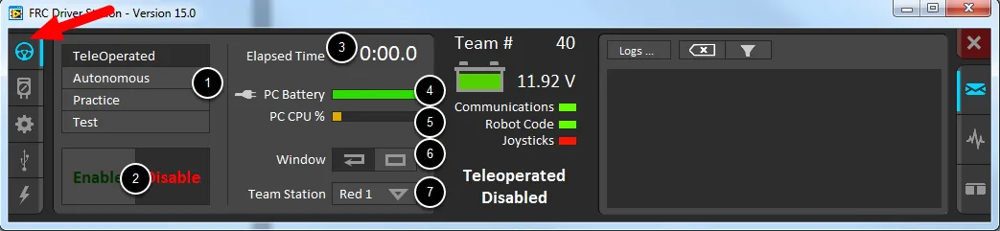
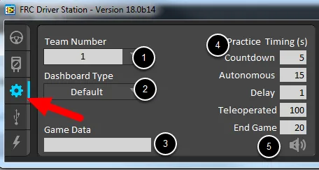

# 前提
## コードの記述箇所
基本的に、`src/main/java/frc/robot`下にある、[`Robot.java`](./src/main/java/frc/robot/Robot.java)にコードを記述していく。  
実行の本体はMain.javaに記述されているが、それは書き換えない。

## モードについて
[DriverStationソフト](https://docs.wpilib.org/en/stable/docs/software/driverstation/index.html)にて、ロボットをenableすることで[`Robot.java`](./src/main/java/frc/robot/Robot.java)に記述したコードが実行される。  
その実行には以下の4つのモードがある。
- TeleOperated
- Autonomous
- Practice
- Test

### モードに応じた実行
それぞれのモードに対してメソッドを記述することで実装していく。  
そのモードがenableされた瞬間、初期化処理が実行され、
それ以降は0.02秒ごとにPeriodic(定期的な)メソッドが繰り返し実行される。

| モード | 意味 | 初期化 | Periodic |
| :--: | :--: | :--: | :--: |
|TeleOperated|手動制御 試合の後半135秒間動く|`teleopInit()`|`teleopPeriodic()`|
|Autonomous|自動制御 試合の前半15秒間動く|`autonomousInit()`|`autonomousPeriodic()`|
|Practice|本番練習用 Practice Timingというものを設定するとそれに従ってTeleOpとAutoが切り替わる|なし|なし|
|Test|テスト用|`testInit()`|`testPeriodic()`|
|Disabled|enableにしていない状態|`disabledInit()`|`disabledPeriodic()`|

また、ロボットを起動した瞬間に`robotInit()`が実行され、
各モードに応じたPeriodicメソッドが実行されたのち、`robotPeriodic()`が実行される。  
`robotInit()`でフィールドの初期化やPIDゲインの設定などを行うと良い。

### モードの特徴
Autonomousモード中はコントローラの入力が一切入らない。

Practiceモードは特殊で、SetUpタブにて設定したPractice Timingに従ってモードが切り替わる。  
下の画像の例では、5秒のカウントダウンの後、15秒Autonomousモードになり、1秒のDelayを挟んだ後、120秒間TeleOperatedになる。(End Game中もTeleOperatedである。)

# SAKURA Tempestaロボットコードの設計解説
前述のように基本的には[`Robot.java`](./src/main/java/frc/robot/Robot.java)にコードを記述していく。  
しかし、Javaはオブジェクト指向言語であり、ロボットもいくつかのオブジェクトの集合体として表現できる。  
他にも、Stateというものを導入することで、コードの実装の分離も可能になる。

これらのことを踏まえ、後述するような設計とした。

## 各ファイルの意図
それぞれのオブジェクトに対応するクラスを[`component`](./src/main/java/frc/robot/component/)下に作成した。
そしてその各オブジェクトは[`Component`](./src/main/java/frc/robot/component/Component.java) Interfaceを継承することとしている。

また、ロボット操作時にいくつのモードが生じることが予想される。  
例えば、ドライブモード(移動やCARGO回収)、発射モード、クライムモードなどが挙げられる。  
それらに対してもクラスを作り、[`mode`](./src/main/java/frc/robot/mode/)下に配置した。  
`component`同様、各モードは[`Mode`](./src/main/java/frc/robot/mode/Mode.java)クラスを継承することとxした。

また、SAKURA Tempestaでは[`State`](./src/main/java/frc/robot/State.java)クラスを導入することで実装の分離を実現している。  

他にも、定数用のクラスとしての[`Const`](src/main/java/frc/robot/subClass/Const.java)、外部センサーとしての[`ExternalSnesors`](src/main/java/frc/robot/subClass/ExternalSensors.java)、便利関数としての[`Util.java`](src/main/java/frc/robot/subClass/Util.java)などが`src/main/java/frc/roboot/subClass`下に配置されている。

## プログラムの流れ
まず、コントローラやセンサの値に応じて`State`を変化させ、
その後に`State`に応じて各`component`を動作させる、という方式をとっている。

# トラブルシューティング
トラブルには様々な種類がある。
- ロボットと接続できない
- Phoenix Tunerが使えない
- enableにした瞬間disableになる
- コントローラが効かない
- ロボットが想定と違う動きをする

